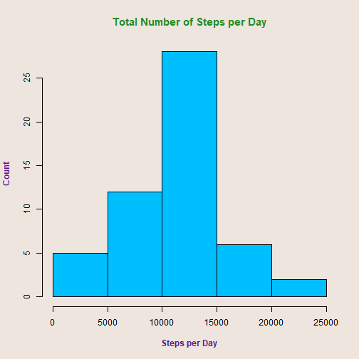
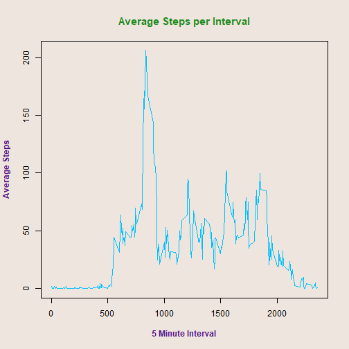
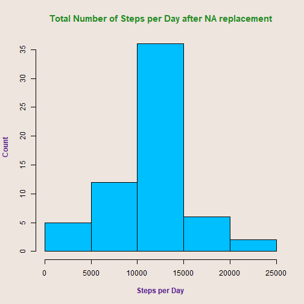
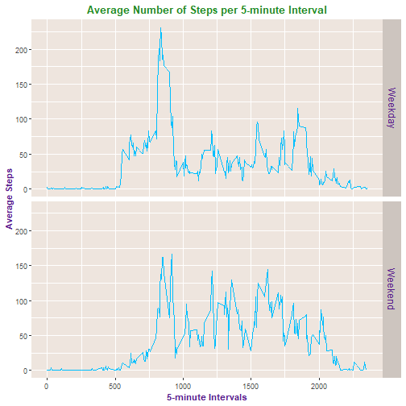

# Analysis of personal movement (steps) using activity monitoring devices.

### Code for reading in the dataset and processing the data.


```r
    library(datasets)
    library(dplyr)
```

```
## 
## Attaching package: 'dplyr'
```

```
## The following objects are masked from 'package:stats':
## 
##     filter, lag
```

```
## The following objects are masked from 'package:base':
## 
##     intersect, setdiff, setequal, union
```

```r
    library(ggplot2)
    setwd("C:\\Users\\Shanon\\Coursera-RR")
    if (!file.exists("RRP1")) {dir.create("./RRP1")}
    setwd("C:\\Users\\Shanon\\Coursera-RR\\RRP1")
    filename <- "C:\\Users\\Shanon\\Coursera-RR\\repdata_data_activity.zip"
    unzip(filename, exdir = "C:\\Users\\Shanon\\Coursera-RR\\RRP1")
    data <- read.csv(file="activity.csv", skip=1, as.is=TRUE, na.strings="NA", sep=",")
    names(data) <- c("Steps", "Date", "Interval")
```
### Histogram of the total number of steps taken each day.  Subsetting the original data by omitting NA rows and formatting the Date column as a date.


```r
    data1 <- data[complete.cases(data), ]
    data1$Date <- as.Date(data1$Date, format="%Y-%m-%d")
    spDay <- data1 %>%
    group_by(Date) %>%
    summarise(TotalSteps=sum(Steps))

    par(col.main="forestgreen", col.lab="purple4", bg ="seashell2", cex.main=1.25, font.lab=2)
    hist(spDay$TotalSteps, main="Total Number of Steps per Day", xlab="Steps per Day",     ylab="Count", col="deepskyblue")
```



```r
    dev.off()
```

```
## null device 
##           1
```

Mean and median number of steps taken each day.


```r
    meanSteps <- mean(spDay$TotalSteps)
    medianSteps <- median(spDay$TotalSteps)
```
For the total number of steps taken per day the mean is 1.0766189 &times; 10<sup>4</sup>, and the median is 10765. 

### Time series plot of the average number of steps taken.


```r
    aspDay <- data1 %>%
    group_by(Interval) %>%
    summarise(AverageSteps=mean(Steps))
    par(col.main="forestgreen", col.lab="purple4", bg ="seashell2", cex.main=1.25, font.lab=2)
    with (aspDay, {
             bp <- plot(aspDay$Interval, aspDay$AverageSteps, type="l", main="Average Steps per Interval", xlab="5 Minute Interval", ylab="Average Steps", col="deepskyblue") 
                  })
```



```r
dev.off()
```

```
## null device 
##           1
```
### The 5-minute interval that, on average, contains the maximum number of steps


```r
    maxStepInterval <- aspDay$Interval[which.max(aspDay$AverageSteps)]
```
The 5-minute interval that has the maximum number of steps, is interval 835.

### Calculate and report the total number of rows of missing values in the dataset. 


```r
    naRowTotal <- sum(!complete.cases(data))
```
The total number of rows with missing values is 2303.

### Code to describe and show a strategy for imputing missing data


```r
    filledData <- data %>%
    group_by(Interval) %>%
    mutate(Steps = replace(Steps, is.na(Steps), mean(Steps, na.rm=TRUE)))
```

### Histogram of the total number of steps taken each day after missing values are imputed.


```r
    spDay2 <- filledData %>%
    group_by(Date) %>%
    summarise(TotalSteps2=sum(Steps))

    par(col.main="forestgreen", col.lab="purple4", bg ="seashell2", cex.main=1.25, font.lab=2)
    hist(spDay2$TotalSteps2, main="Total Number of Steps per Day after NA replacement", xlab="Steps per Day", ylab="Count", col="deepskyblue")
```



```r
    dev.off()
```

```
## null device 
##           1
```
Calculate and report the mean and median total number of steps taken per day. Do these values differ from the estimates from the first part of the assignment? What is the impact of imputing missing data on the estimates of the total daily number of steps?


```r
    meanSteps2 <- mean(spDay2$TotalSteps2)
    medianSteps2 <- median(spDay2$TotalSteps2)
```
For the total number of steps taken per day the mean is 1.0766161 &times; 10<sup>4</sup>, and the median is 1.0766189 &times; 10<sup>4</sup>.  For the total number of steps taken per day, with missing data replaced, the mean is 1.0766161 &times; 10<sup>4</sup>, and the median is 1.0766189 &times; 10<sup>4</sup>. There is not even a minor difference in the values between to two datasets, so no real impact with imputing missing data in this case.

### Panel plot comparing the average number of steps taken per 5-minute interval across weekdays and weekends.


```r
    filledData2 <- filledData
    filledData2$Date <- as.Date(filledData2$Date, format="%Y-%m-%d")
    filledData2$DayType <- factor((weekdays(filledData2$Date) %in% c("Saturday", "Sunday")),     levels=c(FALSE,TRUE), labels=c("Weekday", "Weekend"))

    aspDay2 <- filledData2 %>%
    group_by(Interval, DayType) %>%
    summarise(AverageSteps2=mean(Steps))

    b <- ggplot(aspDay2, aes(Interval, AverageSteps2))
    b + geom_line(col="deepskyblue") + facet_grid(DayType~., labeller=label_parsed) + theme(axis.title = element_text(color="purple4", face="bold"), plot.title = element_text(color="forestgreen", face="bold", hjust=0.5), strip.text = element_text(color="purple4", size=12), strip.background = element_rect(fill="seashell3"), panel.background = element_rect(fill="seashell2")) + labs(title="Average Number of Steps per 5-minute Interval") + scale_x_continuous(name="5-minute Intervals") + scale_y_continuous(name="Average Steps")
```



```r
    dev.off()
```

```
## null device 
##           1
```

